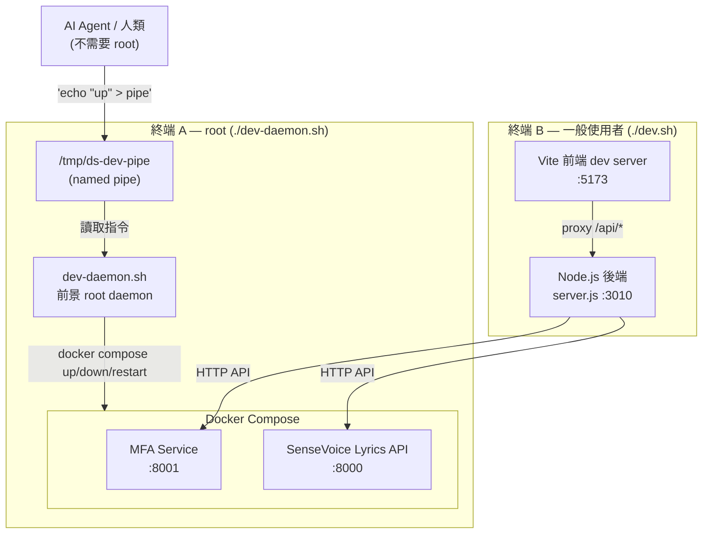

# 開發環境指南（給 AI Agent）

本文件說明如何在開發機上啟動、操作、與停止整個 DiffSinger Training Platform。

---

## 架構概覽

開發環境分為 **4 個服務**，由 **2 個腳本** 管理：



### 為什麼這樣設計？

- Docker 操作需要 root 權限
- AI Agent 通常以一般使用者執行，不能 sudo
- 解法：人類先啟動一個 root daemon，Agent 透過 named pipe 發指令

---

## 快速啟動

### 步驟 1：啟動 Daemon（需要人類操作一次）

```bash
./dev-daemon.sh
```

腳本會自動用 `pkexec` 彈出 GUI 認證視窗提權（如果沒有 pkexec 會 fallback 到 sudo）。
認證完成後 daemon 前景運行，監聽 `/tmp/ds-dev-pipe`。

### 步驟 2：啟動開發環境（Agent 可執行，不需要 root）

```bash
./dev.sh
```

此腳本依序執行：
1. `npm install`（backend + frontend）
2. 透過 pipe 發送 `up` → daemon 啟動 Docker 服務
3. `node server.js`（背景）
4. `cd frontend && npm run dev`（前景）

---

## Agent 操作 Docker 服務

### 前提：確認 daemon 是否在跑

```bash
# 檢查 pipe 是否存在
test -p /tmp/ds-dev-pipe && echo "daemon 在跑" || echo "daemon 沒跑"
```

### 發送指令（不需要 root）

```bash
echo "up"      > /tmp/ds-dev-pipe   # 啟動 Docker 服務 (docker compose up --build -d)
echo "down"    > /tmp/ds-dev-pipe   # 停止 Docker 服務 (docker compose down)
echo "restart" > /tmp/ds-dev-pipe   # 重啟 Docker 服務 (docker compose restart)
echo "rebuild" > /tmp/ds-dev-pipe   # 完整重建 (down → resolve_env → up --build -d)
echo "status"  > /tmp/ds-dev-pipe   # 顯示 docker compose ps
echo "logs"    > /tmp/ds-dev-pipe   # 顯示最近 50 行日誌
```

### 常見場景

**修改了 Dockerfile 或 Docker 相關程式碼：**
```bash
echo "rebuild" > /tmp/ds-dev-pipe
```

**Docker 服務卡住想重啟：**
```bash
echo "restart" > /tmp/ds-dev-pipe
```

**確認 Docker 服務是否正常：**
```bash
echo "status" > /tmp/ds-dev-pipe
# 或直接打 health check API
curl -s http://localhost:3010/api/health | python3 -m json.tool
```

---

## 服務清單 & Port 一覽

| 服務 | 預設 Port | 說明 | 可透過 .env 修改 |
|---|---|---|---|
| Vite 前端 dev server | 5173 | React + Vite HMR | `VITE_PORT` |
| Node.js 後端 | 3010 | Express API server | `BACKEND_PORT` |
| MFA 對齊服務 | 8001 | Docker 容器（Montreal Forced Aligner） | `MFA_PORT` |
| Lyrics 辨識服務 | 8000 | Docker 容器（SenseVoice） | `LYRICS_PORT` |

Vite dev server 已設定 proxy，前端的 `/api/*`、`/upload*` 等路徑會自動轉發到後端。

---

## 停止服務

### 正常停止（Ctrl+C）

- 在 `dev.sh` 的終端按 Ctrl+C → 停止前端 & 後端
- 在 `dev-daemon.sh` 的終端按 Ctrl+C → 停止 daemon & 清除 pipe

### Agent 手動停止

```bash
# 停止 Docker 服務（透過 daemon）
echo "down" > /tmp/ds-dev-pipe

# 停止 Node.js 後端
pkill -f "node server.js"

# 停止 Vite
pkill -f "vite"
```

### 緊急清理（終端意外關閉）

```bash
./dev-stop.sh
```

---

## 檔案清單

| 檔案 | 用途 | 誰執行 |
|---|---|---|
| `dev-daemon.sh` | Root daemon，監聽 pipe 管理 Docker | 人類（自動 pkexec 提權） |
| `dev.sh` | 啟動 npm install + Docker + 後端 + 前端 | Agent 或人類 |
| `dev-stop.sh` | 手動清理所有服務 | Agent 或人類 |
| `/tmp/ds-dev-pipe` | Named pipe（daemon 建立，Agent 寫入） | 自動管理 |

---

## 與 Production 的差異

| | Dev（本機開發） | Production（伺服器） |
|---|---|---|
| 啟動腳本 | `dev-daemon.sh` + `dev.sh` | `sudo ./svc.sh` + `./deploy.sh` |
| Docker 管理 | 前景 daemon + named pipe | systemd service + named pipe |
| Node.js | 直接 `node server.js` | PM2 |
| 前端 | Vite dev server（HMR 熱更新） | `npm run build` → 靜態檔 |
| 需要註冊系統服務 | ❌ | ✅ |
| Pipe 位置 | `/tmp/ds-dev-pipe` | `/run/ds-platform/trigger` |

---

## 疑難排解

### Daemon pipe 不存在
```
❌ Dev daemon 尚未啟動！
```
→ 請人類先執行 `./dev-daemon.sh`

### Docker build 很久
第一次啟動需要 build Docker image（MFA + SenseVoice），可能需要 10-30 分鐘。
後續啟動會用 cache，通常只需幾秒。

### Port 被佔用
修改專案根目錄的 `.env` 檔案：
```env
BACKEND_PORT=3011
MFA_PORT=8002
LYRICS_PORT=8003
```
然後重新執行 `./dev.sh`。

### Docker 服務 health check 失敗
```bash
# 查看 Docker 日誌
echo "logs" > /tmp/ds-dev-pipe

# 嘗試重建
echo "rebuild" > /tmp/ds-dev-pipe
```
