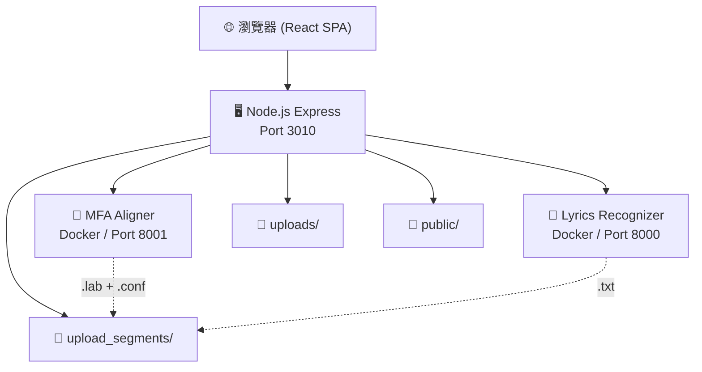
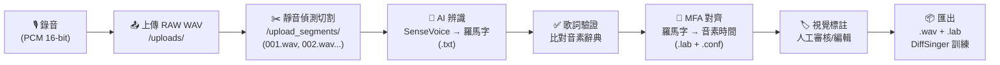
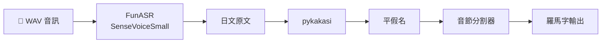
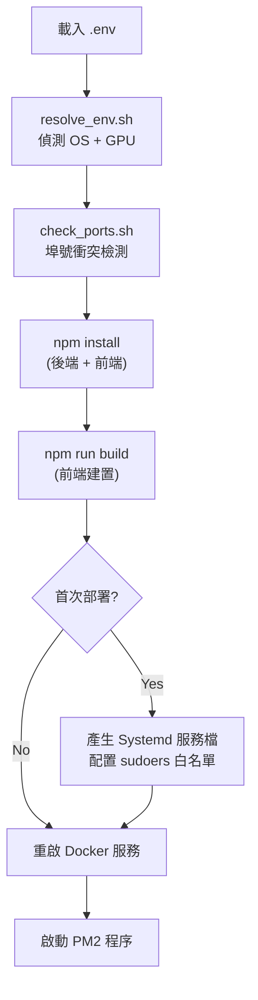

# DiffSinger Training Platform — 專案總結

> AI 歌聲合成訓練資料準備平台，整合 Montreal Forced Aligner (MFA) 與 SenseVoice 語音辨識。

---

## 目錄

- [專案概述](#專案概述)
- [技術堆疊](#技術堆疊)
- [系統架構](#系統架構)
- [資料處理流程](#資料處理流程)
- [後端 (Node.js Express)](#後端-nodejs-express)
- [前端 (React + TypeScript + Vite)](#前端-react--typescript--vite)
- [MFA 對齊服務 (Docker)](#mfa-對齊服務-docker)
- [歌詞辨識服務 (Docker)](#歌詞辨識服務-docker)
- [安全設計 (DevSecOps)](#安全設計-devsecops)
- [部署與更新](#部署與更新)
- [CI/CD](#cicd)
- [測試檔案](#測試檔案)
- [目錄結構](#目錄結構)

---

## 專案概述

DiffSinger Training Platform 是一個 **Docker + Node.js 高可用架構** 的 AI 音訊處理平台，專門用於 **DiffSinger 歌聲合成模型** 的訓練資料準備。

### 核心功能

| 功能 | 說明 |
|------|------|
| 🎙️ 瀏覽器錄音 | PCM 16-bit，原生取樣率，停用所有後處理 |
| ✂️ 音訊切割 | WaveSurfer 波形視覺化，靜音自動偵測分段 |
| 🤖 AI 語音辨識 | FunASR SenseVoice → 日文假名 → 羅馬字轉換 |
| 📐 音素對齊 | Montreal Forced Aligner 時間戳標註 |
| 🏷️ 視覺標註 | 頻譜圖 + 波形 + 信心分數的互動式編輯器 |
| 📖 辭典管理 | 自訂音素辭典與 MFA 映射表 |
| 🔒 DevSecOps 安全 | 指紋掃描、信任等級授權、無密碼服務重啟 |

### 支援語言

目前主要支援 **日文 (Japanese)**，透過：
- SenseVoice 日語語音辨識
- pykakasi 漢字→平假名→羅馬字轉換
- 完整的日文羅馬字↔IPA 音素映射表（114 個辭典條目 + 33 個反向映射）

---

## 技術堆疊

### 後端
| 技術 | 版本 | 用途 |
|------|------|------|
| Node.js + Express | v5.2.1 | REST API 伺服器 |
| Multer | v2.1.1 | 檔案上傳處理 |
| PM2 | — | 程序管理 |
| Axios | — | HTTP 代理轉發 |

### 前端
| 技術 | 版本 | 用途 |
|------|------|------|
| React | v19 | UI 框架 |
| TypeScript | v6 | 型別安全 |
| Vite | v8 | 建置工具 |
| WaveSurfer.js | v7.12 | 波形視覺化 + 頻譜圖 |
| Crunker | v2.4 | WAV 編碼/切割 |

### Docker 服務
| 服務 | 基底映像 | 用途 |
|------|----------|------|
| MFA Aligner | `mmcauliffe/montreal-forced-aligner:latest` | 音素時間對齊 |
| Lyrics Recognizer | `nvidia/cuda:${BASE_IMAGE_TAG}` | SenseVoice 語音辨識 |

---

## 系統架構



### 服務埠號

| 服務 | 預設埠 | 環境變數 |
|------|--------|----------|
| Node.js Backend | 3010 | `BACKEND_PORT` |
| Lyrics Recognizer | 8000 | `LYRICS_PORT` |
| MFA Aligner | 8001 | `MFA_PORT` |

---

## 資料處理流程



### 檔案格式對照

| 副檔名 | 內容 | 範例 |
|--------|------|------|
| `.wav` | 音訊切段 | `5001.wav` |
| `.txt` | 羅馬字歌詞 | `5001.txt` |
| `.lab` | 音素時間標註（乾淨版） | `5001.lab` |
| `.conf` | 含信心分數的對齊結果 | `5001.conf` |
| `.pending` | AI 辨識結果待確認標記 | `5011.pending` |

---

## 後端 (Node.js Express)

> [server.js](../server.js) — 455 行

### API 端點一覽

#### 錄音與檔案管理
| 方法 | 路由 | 說明 |
|------|------|------|
| `GET` | `/api/recordings` | 列出所有錄音與切段（含歌詞、對齊狀態、pending 狀態） |
| `POST` | `/upload` | 上傳音訊檔案（原始或切段） |
| `POST` | `/api/lyrics` | 儲存單一切段歌詞 |
| `POST` | `/api/lyrics/bulk` | 批次儲存多個切段歌詞 |

#### MFA 對齊
| 方法 | 路由 | 說明 |
|------|------|------|
| `POST` | `/api/align` | 提交對齊任務（排隊、非同步、批次） |
| `GET` | `/api/jobs/:id` | 輪詢任務狀態 |
| `GET` | `/api/lab/:filename` | 取得 .lab 對齊結果 |
| `GET` | `/api/conf/:filename` | 取得 .conf 信心分數 |
| `POST` | `/api/lab/:filename` | 儲存編輯後的 .lab 檔 |
| `POST` | `/api/validate_lyrics` | 驗證歌詞是否符合 MFA 映射 |

#### 辭典與映射管理
| 方法 | 路由 | 說明 |
|------|------|------|
| `GET` | `/api/dictionaries` | 列出所有音素辭典 |
| `POST` | `/api/dictionaries` | 建立/更新辭典 |
| `DELETE` | `/api/dictionaries/:id` | 刪除辭典 |
| `GET` | `/api/mappings` | 列出所有 MFA 映射 |
| `POST` | `/api/mappings` | 建立/更新映射 |
| `DELETE` | `/api/mappings/:id` | 刪除映射 |

#### MFA 模型代理
| 方法 | 路由 | 說明 |
|------|------|------|
| `GET` | `/api/mfa/models` | 列出可用聲學模型 |
| `GET` | `/api/mfa/phones/:model` | 取得模型音素集 |

#### AI 辨識
| 方法 | 路由 | 說明 |
|------|------|------|
| `POST` | `/api/transcribe` | 觸發 AI 語音辨識 |

### MFA 佇列系統

後端實作了 **記憶體內佇列 (in-memory queue)** 進行批次處理：

- **300ms 突發窗口**：收集任務後一次性送出
- **10 分鐘逾時**：每批次超時自動失敗
- **任務自動清理**：完成後 10 分鐘清除
- **非同步輪詢**：前端透過 `/api/jobs/:id` 查詢進度

---

## 前端 (React + TypeScript + Vite)

> [frontend/](../frontend/) 目錄

### 元件架構

#### 主要頁面元件

| 元件 | 檔案 | 說明 |
|------|------|------|
| `App` | [App.tsx](../frontend/src/App.tsx) | 主佈局：Header + Sidebar + 主面板 |
| `AudioSplitter` | [AudioSplitter.tsx](../frontend/src/components/AudioSplitter.tsx) | WaveSurfer 音訊分割器，靜音偵測（-45dB）、自動分段 |
| `LabelEditor` | [LabelEditor.tsx](../frontend/src/components/LabelEditor.tsx) | **最複雜的元件** — 視覺化音素標註編輯器 |
| `RecordingItem` | [RecordingItem.tsx](../frontend/src/components/RecordingItem.tsx) | 單一錄音項目：播放、辨識、對齊、編輯 |

#### LabelEditor 功能特點

- WaveSurfer 波形 + **頻譜圖 (Spectrogram)** + Regions 外掛
- `.lab` 檔案載入/儲存
- **信心分數視覺化**（顏色編碼）
- 字級別播放
- **Undo/Redo** 撤銷重做
- 雙擊分割區域
- 右鍵編輯標籤
- `Ctrl+滾輪` 縮放
- **變速播放**（保持音高）
- 自動字→音素對齊

#### 輔助元件

| 元件 | 說明 |
|------|------|
| `RecordingList` | 錄音列表 + 「全部處理」批次按鈕 |
| `LyricsManager` | 辭典管理 UI |
| `MappingManager` | MFA 映射配置 UI |
| `DeviceSelector` | 音訊輸入設備下拉選單 |
| `RecorderControls` | 開始/停止錄音按鈕 |
| `VolumeMeter` | 即時音量計 |
| `WaveformVisualizer` | 錄音中即時波形 |
| `WaveformViewer` | AudioSplitter 用的 WaveSurfer 實例 |

#### 自定義 Hooks

| Hook | 說明 |
|------|------|
| `useAudioMonitor` | 核心錄音 Hook — 設備管理、PCM 擷取、WAV 編碼 |
| `usePreciseAudio` | 保持音高的變速播放 |
| `useSplitterLogic` | 音訊切割點計算邏輯 |

---

## MFA 對齊服務 (Docker)

> [mfa/mfa_service/](../mfa/mfa_service/) 目錄

### FastAPI 端點

| 方法 | 路由 | 說明 |
|------|------|------|
| `GET` | `/models` | 列出本地/遠端聲學模型（快取 1 小時） |
| `GET` | `/model_phones/{model}` | 取得模型音素集（快取 1 小時） |
| `POST` | `/validate_lyrics` | 驗證歌詞是否符合映射辭典 |
| `POST` | `/align` | 單一檔案對齊 |
| `POST` | `/align_batch` | 批次多檔對齊 |

### 兩階段 Beam Search 策略

```
Stage 1 — 嚴格模式
  beam=30, retry_beam=60

      │ 失敗
      ▼

Stage 2 — 寬鬆模式
  beam=100, retry_beam=400
```

### 信心分數系統

- 從 MFA 內部 SQLite 資料庫提取 `phone_goodness` 分數
- 分數 < -80 標記為 `[!]` 警告
- 回報狀態：`SUCCESS` 或 `WARNING_NEED_REVIEW`

### 日文音素映射

> [japanese_mfa.json](../mfa/mfa_service/app/mappings/japanese_mfa.json)

- **114** 個辭典條目（羅馬字 → IPA 音素序列）
- **33** 個反向映射（IPA → 羅馬字）
- 特殊 Token：`cl`（喉塞音）、`pau`（靜音）、`AP`/`SP`（呼吸/短暫停）

---

## 歌詞辨識服務 (Docker)

> [lyrics_regonizer/](../lyrics_regonizer/) 目錄

### 處理流程



### 音節分割邏輯

- 處理撥音 N（ん）
- 處理促音（っ → `cl`）
- 處理拗音組合
- 支援 ITN（逆文本正規化）和 VAD 合併

### pip-to-uv 包裝器

> [!IMPORTANT]
> Dockerfile 中實作了 **pip-to-uv 包裝器**，攔截所有 `pip install` 呼叫並重導向至 `uv`，
> 防止 FunASR 在背景偷偷執行 `pip install` 導致的依賴衝突。

---

## 安全設計 (DevSecOps)

> [SECURITY_DESIGN.md](../SECURITY_DESIGN.md)

### 五大核心設計

| # | 設計 | 說明 |
|---|------|------|
| 1 | **Systemd 權限隔離** | Docker 存取透過 systemd 服務仲介，不使用 docker 群組 |
| 2 | **無密碼自動重啟** | sudoers 白名單限定 `systemctl restart ds-mfa/ds-lyrics` 和 `journalctl` |
| 3 | **全域指紋掃描** | 所有 `.sh`、`.py`、`.js`、`Dockerfile`、`.yml`、`.yaml`、`.env` 的 SHA256 指紋 |
| 4 | **智能環境解析** | 動態偵測 OS 和 GPU 驅動，自動調整 CUDA 版本 |
| 5 | **pip-to-uv 包裝器** | 攔截 Docker 內所有 pip 呼叫，重導向至 uv |

### 信任管理

> [trust_manager.sh](../scripts/trust_manager.sh) / [verify_trust.sh](../scripts/verify_trust.sh)

| 模式 | 說明 |
|------|------|
| `REPO` | 信任未來更新，驗證 HEAD 是可信 commit 的後代 |
| `COMMIT` | 僅信任當前 commit，要求完全匹配 |

指紋驗證作為 **Systemd ExecStartPre** 執行，服務啟動前自動檢查，偵測到未授權變更即阻擋啟動。

---

## 部署與更新

### 部署流程 ([deploy.sh](../deploy.sh))



### 環境自動偵測 ([resolve_env.sh](../scripts/resolve_env.sh))

**三級優先順序**：L1（使用者 .env 覆寫）> L2（自動偵測）> L3（預設值）

| 偵測項目 | 邏輯 |
|----------|------|
| Host OS | `/etc/os-release` → 選擇 Ubuntu 20.04 或 22.04 基底映像 |
| NVIDIA 驅動 ≥ 525 | CUDA 12.1.0 + PyTorch 2.1.2 |
| NVIDIA 驅動 ≥ 450 | CUDA 11.0.3 + PyTorch 1.7.1+cu110 |

### 更新流程 ([update.sh](../update.sh))

1. `git fetch` 比對本地 vs 遠端
2. 顯示 commit diff，確認 `git pull`
3. 選擇信任等級（REPO / COMMIT / CANCEL）
4. 執行 `trust_manager.sh` 更新指紋
5. 執行 `deploy.sh`

---

## CI/CD

> [.github/workflows/deploy.yml](../.github/workflows/deploy.yml)

| 項目 | 值 |
|------|-----|
| 觸發條件 | Push to `master` 或 `main` |
| 執行環境 | **Self-hosted** runner |
| 生產路徑 | `/home/codingbear/DiffSinger-Trainning-Platform` |
| 信任模式 | `COMMIT`（僅信任當前 commit） |

流程：`git fetch` → `git reset --hard` → `trust_manager.sh COMMIT` → `deploy.sh`

---

## 測試檔案

| 檔案 | 說明 |
|------|------|
| [test_mfa.py](../test_mfa.py) | 單一檔案 MFA 對齊測試 |
| [test_mfa_multi.py](../test_mfa_multi.py) | 多切段對齊測試 (001-003) |
| [test_mfa_confidence_batch.py](../test_mfa_confidence_batch.py) | 批次對齊 + 信心分數測試 |
| [test_mfa_mismatch.py](../test_mfa_mismatch.py) | 壓力測試：正確音訊 + 錯誤歌詞 |
| [test_mfa_real_mismatch.py](../test_mfa_real_mismatch.py) | 真實場景不匹配測試 |
| [test_full_baseline.py](../test_full_baseline.py) | 全資料集批次測試（50 個一批） |

---

## 目錄結構

```
DiffSinger-Trainning-Platform/
├── server.js                    # Express 後端 (Port 3010)
├── package.json                 # 後端依賴
├── deploy.sh                    # 部署腳本
├── update.sh                    # 更新腳本
│
├── frontend/                    # React + TypeScript + Vite
│   ├── src/
│   │   ├── App.tsx              # 主應用元件
│   │   ├── components/          # UI 元件
│   │   │   ├── LabelEditor.tsx  # 視覺標註編輯器 ⭐
│   │   │   ├── AudioSplitter.tsx
│   │   │   ├── RecordingItem.tsx
│   │   │   ├── LyricsManager.tsx
│   │   │   ├── MappingManager.tsx
│   │   │   └── ...
│   │   ├── hooks/               # 自定義 Hooks
│   │   └── utils/               # 工具函式
│   └── vite.config.ts
│
├── mfa/mfa_service/             # MFA Docker 服務
│   ├── Dockerfile
│   ├── docker-compose.yml
│   ├── app/
│   │   ├── main.py              # FastAPI 對齊 API
│   │   └── mappings/            # 音素映射檔
│   └── run.sh
│
├── lyrics_regonizer/            # 歌詞辨識 Docker 服務
│   ├── Dockerfile               # pip-to-uv 包裝器
│   ├── docker-compose.yml
│   └── app.py                   # FastAPI 辨識 API
│
├── scripts/                     # 部署與安全腳本
│   ├── resolve_env.sh           # 環境自動偵測
│   ├── trust_manager.sh         # 指紋產生
│   ├── verify_trust.sh          # 指紋驗證
│   └── check_ports.sh           # 埠號衝突檢測
│
├── dictionaries/                # 音素辭典 (JSON)
├── uploads/                     # 原始錄音上傳
├── upload_segments/             # 切割後的音訊切段
├── public/                      # 前端建置輸出
├── docs/                        # 文件 (待填充)
├── .github/workflows/           # GitHub Actions CI/CD
└── test_*.py                    # Python 測試腳本
```

---

## 關鍵設計決策

> [!NOTE]
> **為何使用 ScriptProcessorNode 而非 AudioWorklet？**
> 為了直接取得 Float32Array PCM 資料進行原始品質錄音，
> 並停用 echoCancellation、autoGainControl、noiseSuppression 以保持原生保真度。

> [!NOTE]
> **為何 MFA 使用兩階段 Beam Search？**
> Stage 1 使用嚴格參數快速對齊正常資料；
> Stage 2 使用寬鬆參數挽救困難案例，避免直接失敗。

> [!NOTE]
> **為何使用 pip-to-uv 包裝器？**
> FunASR 在執行時會暗中呼叫 `pip install`，
> 導致 Docker 容器內的依賴被覆寫。uv 包裝器攔截這些呼叫以維持環境穩定。

> [!WARNING]
> **Systemd 服務名稱硬編碼**
> `ds-mfa` 和 `ds-lyrics` 的服務名稱在多個腳本中硬編碼，
> 修改時需同步更新 `deploy.sh`、`trust_manager.sh`、`verify_trust.sh` 和 sudoers 設定。
